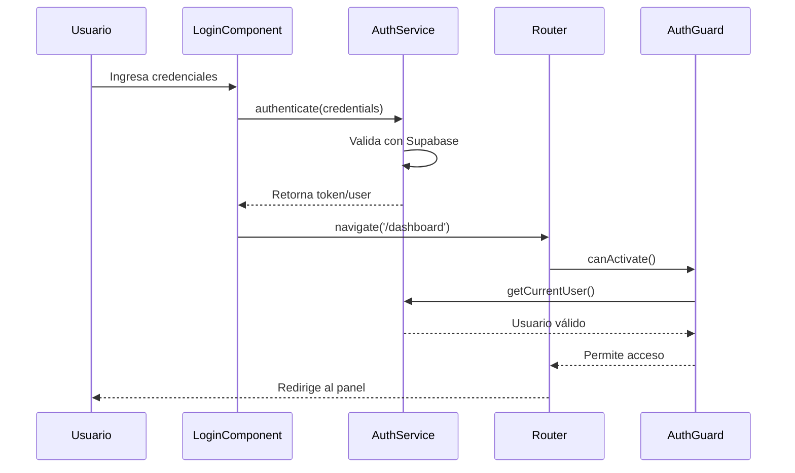
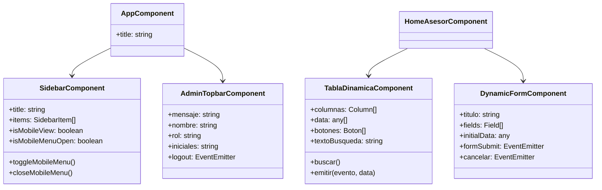
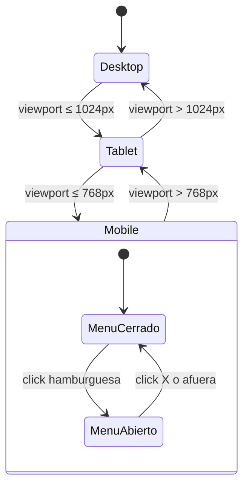

# RISKLESS DIEM - Sistema de Gestión de Seguros

## Tabla de Contenidos

- [Descripción del Proyecto](#-descripción-del-proyecto)
- [Arquitectura del Sistema](#-arquitectura-del-sistema)
- [Tecnologías Utilizadas](#-tecnologías-utilizadas)
- [Diagramas de Arquitectura](#-diagramas-de-arquitectura)
- [Instalación y Ejecución](#-instalación-y-ejecución)
- [Estructura del Proyecto](#-estructura-del-proyecto)
- [Configuración](#-configuración)
- [Roles de Usuario](#-roles-de-usuario)
- [Módulos Principales](#-módulos-principales)

---

## Descripción del Proyecto

**RISKLESS DIEM** es una aplicación web moderna desarrollada en Angular 19 para la gestión integral de seguros. Proporciona una interfaz intuitiva y responsiva para administrar pólizas, asegurados, bienes, siniestros y facturación.

### Características Principales
- **Diseño Responsivo**: Adaptado para desktop, tablet y móvil
- **Menú Hamburguesa**: Navegación optimizada para dispositivos móviles
- **Gestión por Roles**: Administrador, Gerente y Asesor
- **Interfaz Moderna**: Diseño con colores de marca RISKLESS
- **Componentes Reutilizables**: Arquitectura modular y mantenible

---

## Arquitectura del Sistema

### Estructura de Componentes

```
src/app/
├── auth/                    # Autenticación de usuarios
├── pages/                   # Páginas principales por rol
│   ├── home-admin/          # Panel de administrador
│   ├── home-gerente/        # Dashboard gerencial
│   └── home-asesor/         # Panel de asesor con submódulos
├── shared/                  # Componentes compartidos
│   ├── components/
│   │   ├── sidebar/         # Navegación lateral responsiva
│   │   └── reuzables/      # Componentes genéricos
│   └── styles/             # Variables SCSS globales
├── services/                # Lógica de negocio
├── interfaces/              # Tipos TypeScript
└── guards/                 # Protección de rutas
```

---

## Tecnologías Utilizadas

### Frontend
- **Angular 19** - Framework principal
- **TypeScript** - Tipado estático
- **SCSS** - Preprocesador CSS con variables de marca
- **Angular Material** - Componentes UI
- **Angular CDK** - Utilidades de layout
- **Chart.js + ng2-charts** - Visualización de datos
- **Supabase** - Backend como servicio

### Herramientas de Desarrollo
- **Angular CLI** - Andamiaje y desarrollo
- **RxJS** - Programación reactiva
- **ESLint** - Calidad de código

---

## Diagramas de Arquitectura

### Diagrama de Secuencia - Flujo de Autenticación



### Diagrama de Clases - Estructura Principal



### Diagrama de Estados - Gestión de Responsive



---

## Instalación y Ejecución

### Prerrequisitos
- **Node.js** (versión 18 o superior)
- **npm** (versión 9 o superior)
- **Git** para clonar el repositorio

### Clonar el Proyecto

```bash
# Clonar el repositorio
git clone https://github.com/tu-usuario/RISKLESS-DIEM.git

# Entrar al directorio del proyecto
cd RISKLESS-DIEM
```

### Instalar Dependencias

```bash
# Instalar todas las dependencias del proyecto
npm install
```

### Configurar Variables de Entorno

Crear archivo `.env` en la raíz del proyecto:

```env
# Configuración de Supabase
SUPABASE_URL=tu-url-de-supabase
SUPABASE_ANON_KEY=tu-key-anonima-de-supabase
SUPABASE_SERVICE_ROLE_KEY=tu-key-de-servicio

# Configuración de EmailJS (opcional)
EMAILJS_PUBLIC_KEY=tu-public-key
EMAILJS_SERVICE_ID=tu-service-id
EMAILJS_TEMPLATE_ID=tu-template-id
```

### Ejecutar en Modo Desarrollo

```bash
# Iniciar servidor de desarrollo
npm start

# O alternativamente
ng serve --port 4200
```

La aplicación estará disponible en: **http://localhost:4200**

### Construir para Producción

```bash
# Construir versión optimizada
npm run build

# Los archivos generados estarán en /dist/riskless-diem
```

### Ejecutar Pruebas

```bash
# Ejecutar pruebas unitarias
npm test

# Ejecutar pruebas con coverage
npm run test:coverage
```

---

## Estructura del Proyecto

### Directorios Principales

```
RISKLESS-DIEM/
├── src/                    # Código fuente
│   ├── app/               # Aplicación Angular
│   │   ├── auth/           # Módulo de autenticación
│   │   ├── pages/          # Páginas por rol
│   │   ├── shared/         # Componentes compartidos
│   │   ├── services/        # Servicios de negocio
│   │   ├── interfaces/      # Definiciones TypeScript
│   │   └── guards/         # Guards de rutas
│   ├── index.html          # Template principal
│   ├── styles.scss         # Estilos globales
│   └── main.ts            # Punto de entrada
├── public/                 # Archivos estáticos
├── package.json           # Dependencias y scripts
├── angular.json           # Configuración Angular
├── tsconfig.json          # Configuración TypeScript
└── README.md              # Este archivo
```

### Sistema de Diseño

#### Variables SCSS
- **Colores**: `src/app/shared/styles/_colores.scss`
- **Tipografía**: `src/app/shared/styles/_tipografia.scss`
- **Breakpoints**: Desktop (>1024px), Tablet (768px-1024px), Mobile (<768px)

#### Paleta de Colores RISKLESS
```scss
// Colores primarios
$color-dorado: #C6AF6B;
$color-azul-oscuro: #062140;
$color-azul-celeste: #3891F4;

// Tipografía
$font-poppins: 'Poppins', sans-serif;
$font-work-sans: 'Work Sans', sans-serif;
```

---

## Configuración

### Configuración Angular

El proyecto utiliza configuración estándar de Angular 19 con:

- **Standalone Components**: Componentes auto-contenidos
- **SCSS**: Preprocesador CSS por defecto
- **ViewEncapsulation**: Emulated para aislar estilos
- **Lazy Loading**: Carga bajo demanda de módulos

### Configuración de Rutas

```typescript
// Estructura de rutas principales
{
  path: 'login',
  component: LoginComponent
},
{
  path: 'admin',
  component: HomeAdminComponent,
  data: { rol: 'Administrador' }
},
{
  path: 'asesor',
  component: HomeAsesorComponent,
  children: [
    { path: 'asegurados', component: AseguradosComponent },
    { path: 'polizas', component: PolizasComponent },
    // ... más rutas hijas
  ]
}
```

---

## Roles de Usuario

### Administrador
- **Gestión de usuarios del sistema**
- **Configuración global**
- **Acceso a todos los módulos**
- **Reportes administrativos**

### Gerente
- **Dashboard con KPIs y métricas**
- **Visualización de gráficos y reportes**
- **Supervisión de operaciones**
- **Análisis de rendimiento**

### Asesor
- **Gestión de asegurados**
- **Administración de bienes**
- **Creación y gestión de pólizas**
- **Procesamiento de siniestros**
- **Gestión de facturación**

---

## Módulos Principales

### Asegurados
- **CRUD completo** de asegurados
- **Búsqueda y filtrado** avanzado
- **Exportación** de datos
- **Validación** de información

### Pólizas
- **Gestión** de pólizas activas
- **Creación** de nuevas pólizas
- **Renovaciones** automáticas
- **Historial** de cambios

### Bienes
- **Inventario** de bienes asegurados
- **Categorización** por tipo
- **Valorización** actualizada
- **Documentación** adjunta

### Siniestros
- **Registro** de siniestros
- **Seguimiento** de casos
- **Evaluación** de daños
- **Procesamiento** de reclamaciones

### Facturación
- **Generación** de facturas
- **Control** de pagos
- **Reportes** financieros
- **Integración** con pasarelas

---

## Características Técnicas

### Responsividad
- **Desktop**: Layout completo con sidebar fijo
- **Tablet**: Sidebar compacto de 80px
- **Mobile**: Menú hamburguesa con overlay

### Diseño UI/UX
- **Colores de marca** RISKLESS consistentes
- **Micro-interacciones** suaves
- **Feedback visual** inmediato
- **Accesibilidad** WCAG 2.1

### Performance
- **Lazy loading** de módulos
- **Bundle splitting** optimizado
- **Imágenes optimizadas**
- **Cache inteligente**

---

## Contribución

### Requisitos para Contribuir
1. **Fork** del repositorio
2. **Rama** feature/nombre-característica
3. **Commits** descriptivos
4. **Pull Request** con descripción detallada

### Estándares de Código
- **TypeScript** estricto
- **SCSS** con variables globales
- **Componentes** standalone
- **Testing** unitario mínimo 80%

---

## Licencia

Este proyecto está bajo licencia MIT. Ver archivo `LICENSE` para más detalles.

---

## Contacto

- **Desarrollo**: development@riskless.com
- **Soporte**: soporte@riskless.com
- **Documentación**: docs.riskless.com

---

**RISKLESS DIEM** - Transformando la gestión de seguros con tecnología moderna.
